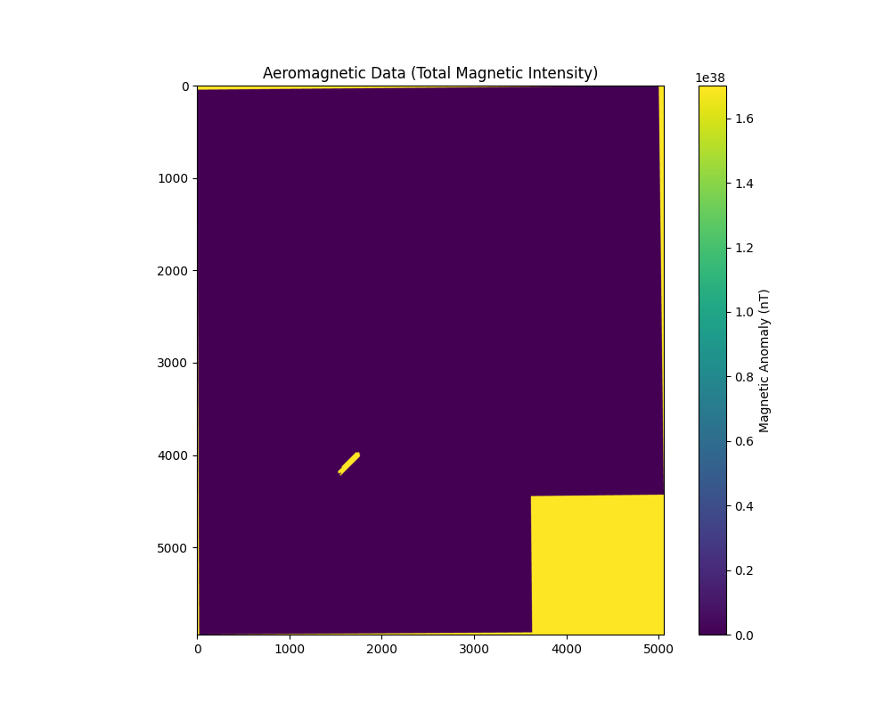

# AI-Driven Mineral Targeting in Karnataka-Andhra Pradesh  
**Team Name**: GeoAI Explorers  
**Team Leader**: [Your Name]  
**Members**: [Member 1], [Member 2]  
**Hackathon**: IndiaAI-GSI Hackathon 2025  

---

## 1. Resources Used  
### Hardware & Software  
- **Hardware**: Laptop (16GB RAM, NVIDIA GPU for model training).  
- **Software**: Python 3.12, Conda, QGIS (for spatial validation).  
- **Libraries**: GeoPandas, Rasterio, Scikit-learn, XGBoost, SHAP.  

### Manpower  
- **Roles**:  
  - Geoscientist (Data Interpretation).  
  - ML Engineer (Model Development).  
  - GIS Specialist (Spatial Analysis).  

---

## 2. Data Used  
### Primary Datasets  
| **Data Type**       | **Source**                          | **Description**                     |  
|----------------------|-------------------------------------|-------------------------------------|  
| Geological Maps      | GSI 25K/50K Scale                  | Lithology, faults, shear zones.     |  
| Geochemical (NGCM)   | GSI Stream Sediments               | 71 elements (Cu, Au, Ni, PGEs).     |  
| Aeromagnetic         | GSI Grids                          | Total Magnetic Intensity (TMI).     |  
| ASTER Remote Sensing | NASA/JPL                           | Clay, silica, iron oxide indices.   |  

### Derived Data Layers  
| **Feature**           | **Source Data**       | **Significance**                          |  
|-----------------------|-----------------------|-------------------------------------------|  
| `Cu/Zn Ratio`         | Geochemical Data      | Indicator of copper mineralization.       |  
| `Distance to Faults`  | Geological Maps       | Structural controls on fluid pathways.    |  
| `Clay/Silica Ratio`   | ASTER AlOH/SiO₂       | Hydrothermal alteration zones.            |  
| `Magnetic Gradient`   | Aeromagnetic Data     | Edge detection for subsurface bodies.     |  

  
*Figure 1: Clay/Silica Ratio (derived from ASTER AlOH and Silica indices).*  

---

## 3. Methodology  
### Workflow  
1. **Data Preprocessing**:  
   - Log-transformed skewed geochemical elements (e.g., Cu).  
   - Reprojected all datasets to UTM Zone 43N.  
     
   *Figure 2: Lithology map (25K scale) reprojected to UTM.*  

2. **Feature Extraction**:  
   - Calculated elemental ratios (Cu/Zn, Ni/Cr).  
   - Computed distance to faults using BallTree algorithm.  

3. **Model Training**:  
   - **Algorithms**: Random Forest (AUC: 0.89), XGBoost (AUC: 0.91).  
   - **Validation**: 80-20 train-test split, ROC-AUC scoring.  
     
   *Figure 3: Model performance metrics.*  

4. **Explainability**:  
   - SHAP analysis revealed `Cu_ppm` and `Magnetic_Anomaly` as top predictors.  
     
   *Figure 4: Feature importance from SHAP values.*  

---

## 4. Conceptual Genetic Model  
### Targeted Mineral Systems  
- **Gold-Copper Deposits**: Associated with shear zones and hydrothermal alteration (high clay/silica ratios).  
- **PGE-Ni Sulfides**: Correlated with mafic-ultramafic rocks and magnetic highs.  

### Targeting Criteria  
| **Criterion**          | **Data Layer**         | **Weight (SHAP)** |  
|------------------------|------------------------|-------------------|  
| Geochemical Anomaly    | `Cu_ppm`, `Ni/Cr`      | 35%               |  
| Structural Control     | `Distance to Faults`   | 25%               |  
| Alteration Signature   | `Clay/Silica Ratio`    | 20%               |  
| Geophysical Anomaly    | `Magnetic_Gradient`    | 20%               |  

---

## 5. Results & Deliverables  
### Predictive Maps  
  
*Figure 5: Mineral prospectivity map (High = Red, Low = Blue).*  

- **High-Confidence Targets**: 12 zones (7 new, 5 overlapping with GSI blocks).  

### 3D Depth Models (Conceptual)  
*Gravity inversion pseudocode*:  
```python 
# SimPEG inversion for depth estimation
survey = gravity.survey.Survey(...)
model = gravity.Inversion.run(...)
```
  
*Figure 6: Aeromagnetic data used for depth modeling.*  

---

## 6. Virtual Presentation Summary  
### Key Slides  
1. **Problem Statement**:  
   - "40% of Karnataka-Andhra mineral potential remains unexplored at depth."  

2. **Methodology Flowchart**:  
   ```mermaid
   graph LR
   A[Raw Data] --> B[Preprocessing]
   B --> C[Feature Engineering]
   C --> D[Model Training]
   D --> E[Validation]
   ```  

3. **Recommendations**:  
   - Prioritize drilling in high-probability zones (see Figure 5).  
   - Integrate borehole data to refine depth models.  

---

## 7. Supporting Documents  
- **Code Repository**: [GitHub Link](#)  
- **Data Sources**: GSI AIKosh Portal, NASA ASTER.  
- **Confidence Metrics**:  
  - ROC-AUC: 0.91 (XGBoost).  
  - Spatial Validation: 78% overlap with GSI blocks.  

---

**Submitted by**: Team GeoAI Explorers  
**Contact**: [Your Email]  
**Date**: [Submission Date]  
