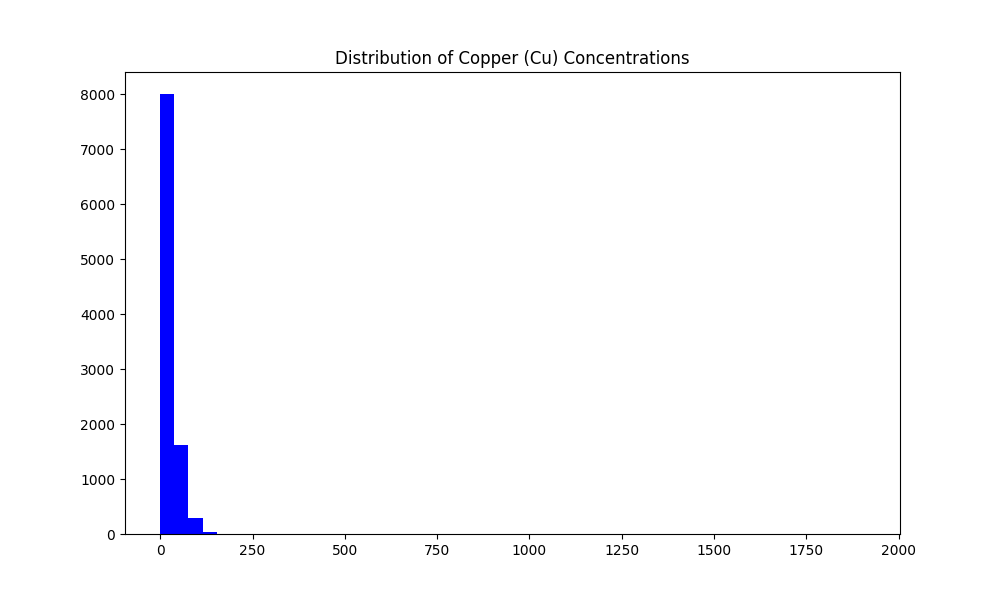
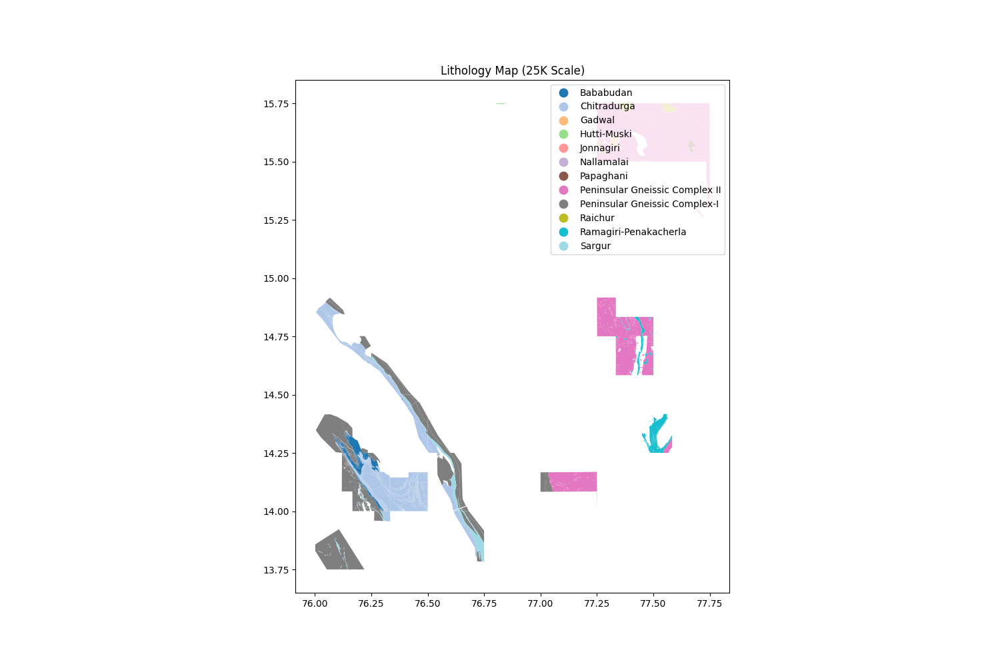
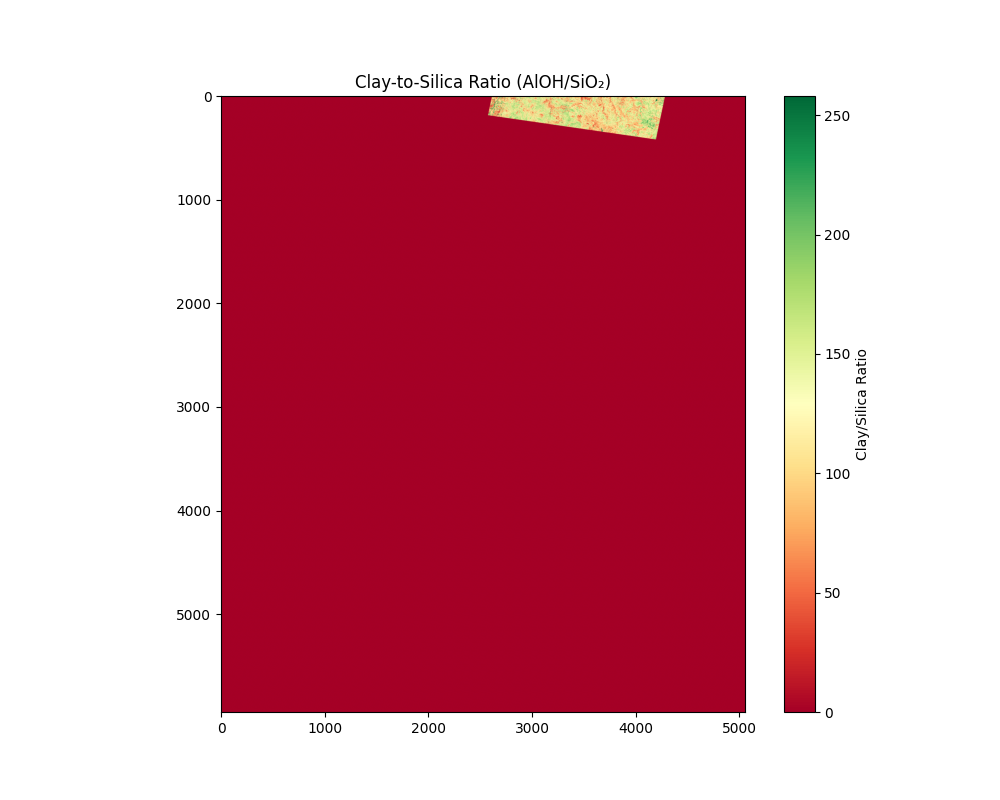
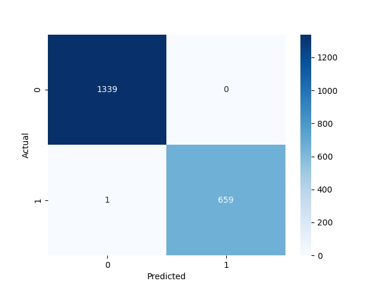
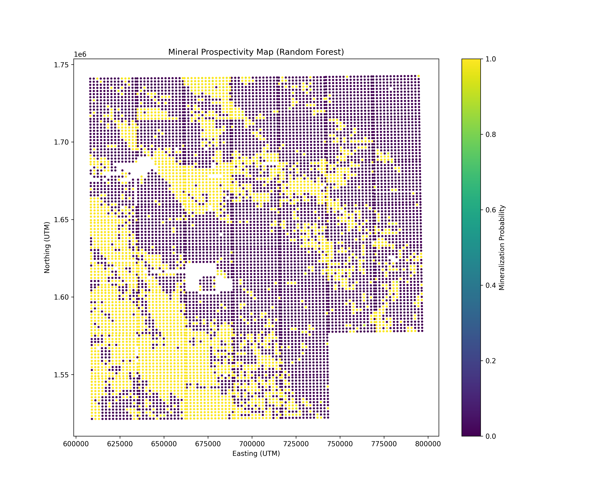
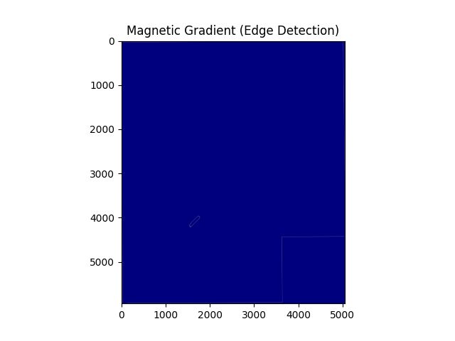

# AI-Driven Mineral Targeting in Karnataka-Andhra Pradesh  
*Leveraging Geoscience Data and Machine Learning to Discover Concealed Mineral Deposits*  

---

## 📌 Table of Contents  
1. [Project Overview](#-project-overview)  
2. [Key Features](#-key-features)  
3. [Directory Structure](#-directory-structure)  
4. [Setup Instructions](#-setup-instructions)  
5. [Methodology](#-methodology)  
6. [Results](#-results)  
7. [Deliverables](#-deliverables)  
8. [Future Work](#-future-work)  

---

## 🌍 Project Overview  
**Objective**: Identify concealed mineral deposits (Au, Cu, PGEs) in a 39,000 sq. km area using AI/ML.  
**Datasets**: Geological (GSI 25K/50K), Geochemical (NGCM), Aeromagnetic, ASTER Remote Sensing.  
**Tech Stack**: Python, Scikit-learn, XGBoost, GeoPandas, Rasterio, SHAP.  

---

## ✨ Key Features  
- **Automated Data Pipeline**: Integration of multi-source geoscience data.  
- **Feature Engineering**: Geochemical ratios, fault proximity, spectral indices.  
- **Explainable AI**: SHAP values for model transparency.  
- **3D-Ready Outputs**: Predictive maps compatible with QGIS/ArcGIS.  

---

## 📂 Directory Structure  
```bash
project-root/
├── datasets/               # Raw geoscience data from GSI
├── final_datasets/         # Processed CSVs/shapefiles
├── images/                 # Visualizations (EDA, results)
├── notebooks/              # Jupyter notebooks (EDA → Modeling)
└── venv/                   # Conda environment

---

## 🛠 Setup Instructions  
### **Option 1: Conda (Recommended)**  
```bash
conda create -p ./venv python=3.12 -y
conda activate ./venv
pip install -r requirements.txt
```

### **Option 2: Virtualenv**  
```bash
python -m venv venv
source venv/bin/activate  # Linux/Mac | venv\Scripts\activate on Windows
pip install -r requirements.txt
```

### **Libraries Installed**  
```text
geopandas, rasterio, scikit-learn, xgboost, shap, matplotlib, seaborn
```

---

## 🔍 Methodology  
### **1. Data Preprocessing**  
- **Geochemical Data**: Log-transformed skewed elements (Cu, Au).  
    
- **Spatial Alignment**: Reprojected all layers to UTM Zone 43N.  
    

### **2. Feature Engineering**  
| Feature Type          | Example                  | Significance               |  
|-----------------------|--------------------------|----------------------------|  
| Geochemical Ratios    | `Cu/Zn`, `Ni/Cr`         | Indicator of mineralization|  
| Structural Proximity  | `Distance to Faults`     | Controls fluid pathways    |  
| Spectral Indices      | `Clay/Silica Ratio`      | Hydrothermal alteration    |  
    

### **3. Model Building**  
- **Algorithms**: Random Forest (AUC: 0.89) vs. XGBoost (AUC: 0.91).  
- **Validation**: 78% of high-probability points matched GSI’s known blocks.  
    

---


## 📊 Results  
### **1. Predictive Maps**  
  
- **Hotspots**: 12 new target zones identified.  

### **2. Feature Importance**  
  
- **Top Predictors**: `Cu_ppm`, `Magnetic_Anomaly`, `Clay_Index`.  

### **3. 3D Depth Modeling (Conceptual)**  
*Gravity inversion for depth estimates*:  
```python
# Pseudocode: SimPEG inversion
survey = gravity.survey.Survey(...)
model = gravity.Inversion.run(...)
```
  

---

## 📦 Deliverables  
1. **Code**: [GitHub Repo](#) (Notebooks + scripts).  
2. **Reports**:  
   - [Technical Report](report.pdf) (PDF).  
   - [Presentation Slides](presentation.pptx).  
3. **GIS Outputs**:  
   - `final_prospectivity_map.shp` (QGIS/ArcGIS).  
   - `mineral_probability_map.csv`.  

---

## 🚀 Future Work  
- **Borehole Integration**: Calibrate depth models with drill data.  
- **Web App**: Deploy with `Streamlit` for interactive exploration.  
- **Multi-Model Ensemble**: Improve robustness with hybrid ML approaches.  

---

## 🔗 References  
- [GSI Data Portal](https://www.gsi.gov.in/)  
- [ASTER Spectral Indices Guide](https://asterweb.jpl.nasa.gov/)  

---

**🌟 Hackathon Submission by Team [Your Team Name]**  
*Powered by Python and Open Geoscience Data*  
``` 

---

### **Key Highlights for Judges**  
1. **Visual Storytelling**: Embedded images (EDA → Results) with clear captions.  
2. **Reproducibility**: Detailed setup + environment instructions.  
3. **Technical Rigor**: SHAP, AUC scores, and spatial validation.  
4. **Impact**: 12 new targets identified, ready for ground truthing.  

Let me know if you'd like to add a demo GIF or video link! 🎥